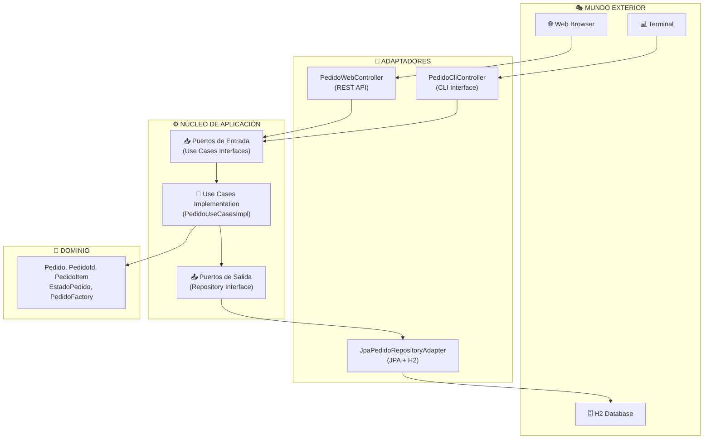

# 🔶 **Pedidos DDD - Arquitectura Hexagonal**
*Ejemplo educativo para aprender DDD y Arquitectura Hexagonal con Spring Boot*

## 🚀 **Inicio Rápido**

```bash
# 1. Ejecutar la aplicación
gradle bootRun

# 2. Ver demo automática en consola al arrancar

# 3. Probar API REST
curl -X POST http://localhost:8080/api/pedidos
curl -X GET http://localhost:8080/api/pedidos/{id}

# 4. Inspeccionar base de datos H2
# URL: http://localhost:8080/h2-console
# JDBC URL: jdbc:h2:mem:pedidosdb
# Username: sa | Password: (vacío)
```

---

## 🏗️ **Estructura del Proyecto**

```
src/main/java/com/example/pedidosddd/
├── 💎 domain/                          # NÚCLEO (sin dependencias externas)
│   └── model/
│       ├── Pedido.java                 # Aggregate Root
│       ├── PedidoId.java               # Value Object (ID tipado)
│       ├── ProductoId.java             # Value Object (ID tipado)
│       ├── PedidoItem.java             # Value Object
│       ├── Producto.java               # Value Object  
│       ├── PedidoFactory.java          # Factory
│       └── EstadoPedido.java           # Enum
│
├── 🎯 application/                      # ORQUESTACIÓN
│   ├── ports/in/                       # Puertos de entrada (Use Cases)
│   │   ├── CrearPedidoUseCase.java
│   │   ├── AgregarProductoUseCase.java
│   │   └── ConsultarPedidoUseCase.java
│   ├── ports/out/                      # Puertos de salida
│   │   └── PedidoRepositoryPort.java
│   └── usecases/
│       └── PedidoUseCasesImpl.java     # Implementación Use Cases
│
└── 🔌 infrastructure/                   # ADAPTADORES (tecnologías específicas)
    └── adapters/
        ├── in/                         # Adaptadores de entrada
        │   ├── web/PedidoWebController.java     # API REST
        │   └── cli/PedidoCliController.java     # CLI
        └── out/persistence/            # Adaptadores de salida
            ├── JpaPedidoRepositoryAdapter.java
            ├── JpaPedidoRepository.java (Spring Data)
            ├── PedidoEntity.java
            ├── PedidoItemEntity.java
            └── PedidoMapper.java
```

---

## 🔄 **Flujo de la Arquitectura**



**🔥 Flujo:** Usuario → Adaptador → Puerto → Use Case → Dominio → Puerto → Adaptador → Persistencia

---

## 🎯 **Conceptos Clave**

### 💎 **Value Objects - Type Safety**

```java
// ❌ ANTES: Primitivos frágiles
public interface AgregarProductoUseCase {
    void agregarProducto(String pedidoId, String productoId); // ¿Cuál es cuál?
}

// 😱 Error catastrófico:
useCase.agregarProducto(productoId, pedidoId); // ¡Parámetros intercambiados!

// ✅ DESPUÉS: Value Objects seguros
public interface AgregarProductoUseCase {
    void agregarProducto(AgregarProductoCommand command);
    
    record AgregarProductoCommand(
        PedidoId pedidoId,      // ← Tipo específico
        ProductoId productoId,  // ← Imposible confundir
        String nombreProducto,
        BigDecimal precio,
        int cantidad
    );
}

// 🛡️ Imposible confundir - Error de compilación:
new AgregarProductoCommand(productoId, pedidoId, ...); // ¡No compila!
```

### 🔶 **Arquitectura Hexagonal - Separación Clara**

| Componente | Responsabilidad | ❌ NO hace | ✅ SÍ hace |
|------------|----------------|------------|-----------|
| **Dominio** | Lógica de negocio | HTTP, SQL, JSON | Validaciones, reglas |
| **Puertos** | Contratos | Implementación | Interfaces |  
| **Use Cases** | Orquestación | Lógica de negocio | Coordinación |
| **Adaptadores** | Traducción | Lógica de negocio | String ↔ Domain |

### 🔄 **Ejemplo Completo**

```java
// 1. 🌐 HTTP Request
POST /api/pedidos/abc123/productos
{"productoId": "LAPTOP-001", "nombreProducto": "Laptop Gaming", "precio": 1200.00}

// 2. 🔌 Adaptador Web: HTTP → Dominio
@RestController
public class PedidoWebController {
    @PostMapping("/{pedidoId}/productos")
    public ResponseEntity<String> agregarProducto(@PathVariable String pedidoId, ...) {
        // Conversión: String → Value Object
        PedidoId id = new PedidoId(pedidoId);
        ProductoId prodId = new ProductoId(request.productoId());
        
        AgregarProductoCommand command = new AgregarProductoCommand(id, prodId, ...);
        useCase.agregarProducto(command); // ← Usa lenguaje del dominio
    }
}

// 3. 🎯 Use Case: Orquestación
@Service
public class PedidoUseCasesImpl implements AgregarProductoUseCase {
    public void agregarProducto(AgregarProductoCommand command) {
        Pedido pedido = repository.findById(command.pedidoId());
        Producto producto = new Producto(command.productoId(), ...);
        pedido.agregarProducto(producto, command.cantidad()); // ← Lógica dominio
        repository.save(pedido);
    }
}

// 4. 💎 Dominio: Lógica de negocio pura
public class Pedido {
    public void agregarProducto(Producto producto, int cantidad) {
        if (estado != EstadoPedido.PENDIENTE) {
            throw new IllegalStateException("No se pueden agregar productos a pedido " + estado);
        }
        items.add(new PedidoItem(producto, cantidad)); // ← Regla de negocio
    }
}
```

---

## 🧪 **Cómo Probarlo**

### 1. **Ver Demo Automática**
Al ejecutar `gradle bootRun`, verás:
```
🔶 DEMO: Arquitectura Hexagonal - Adaptador CLI
1️⃣ Creando pedido desde CLI...
   ✅ Pedido creado: 12345-abcd-6789-efgh
2️⃣ Agregando producto desde CLI...
   ✅ Producto agregado correctamente
```

### 2. **API REST**
```bash
# Crear pedido
curl -X POST http://localhost:8080/api/pedidos
# Respuesta: {"pedidoId":"12345-abcd-6789-efgh"}

# Consultar pedido
curl -X GET http://localhost:8080/api/pedidos/12345-abcd-6789-efgh

# Agregar producto
curl -X POST http://localhost:8080/api/pedidos/12345-abcd-6789-efgh/productos \
  -H "Content-Type: application/json" \
  -d '{"productoId":"LAPTOP-001","nombreProducto":"Laptop Gaming","precio":1200.00,"cantidad":1}'
```

### 3. **Base de Datos H2**
- URL: http://localhost:8080/h2-console
- JDBC: `jdbc:h2:mem:pedidosdb`
- User: `sa` | Password: (vacío)
- Ve las tablas `pedidos` y `pedido_items` con datos reales

---

## ✅ **Ventajas de Esta Arquitectura**

### 🔄 **Flexibilidad Total**
```java
// Mismo núcleo, diferentes interfaces:
- PedidoWebController    (API REST)
- PedidoCliController    (Línea de comandos)  
- PedidoGuiController    (Interfaz gráfica)
- PedidoTestController   (Tests unitarios)
```

### 🛡️ **Testing Simplificado**
```java
@Test
void testCrearPedido() {
    // No necesito Spring, base de datos, web...
    PedidoRepositoryPort mockRepo = mock(PedidoRepositoryPort.class);
    CrearPedidoUseCase useCase = new PedidoUseCasesImpl(mockRepo);
    
    PedidoId resultado = useCase.crearNuevoPedido();
    assertThat(resultado).isNotNull();
}
```

### 🔧 **Cambio de Tecnología Sin Drama**
```java
// Desarrollo: H2 en memoria
@Repository
class JpaPedidoRepositoryAdapter implements PedidoRepositoryPort { }

// Producción: PostgreSQL  
@Repository
class PostgresPedidoAdapter implements PedidoRepositoryPort { }

// Futuro: MongoDB
@Repository  
class MongoPedidoAdapter implements PedidoRepositoryPort { }

// 🔥 El dominio y use cases NUNCA cambian
```

---

## 🎓 **Para Seguir Aprendiendo**

1. **Añadir más Use Cases:** `CancelarPedidoUseCase`, `ActualizarEstadoUseCase`
2. **Nuevos adaptadores:** GraphQL, gRPC, WebSockets
3. **Cambiar persistencia:** PostgreSQL, MongoDB, Redis
4. **Eventos de dominio:** Notificaciones entre agregados
5. **Validaciones avanzadas:** Bean Validation en Commands

---

## 🔑 **Conceptos DDD Aplicados**

- ✅ **Value Objects:** `PedidoId`, `ProductoId` (type safety)
- ✅ **Entities:** `Pedido` (identidad única)
- ✅ **Aggregate Root:** `Pedido` (punto de entrada)
- ✅ **Factory:** `PedidoFactory` (creación controlada)
- ✅ **Repository Pattern:** Abstracción de persistencia
- ✅ **Command Objects:** Encapsulación de entrada
- ✅ **Inversión de Dependencias:** Dominio independiente

**🎯 Este proyecto demuestra DDD + Arquitectura Hexagonal + Value Objects de forma práctica y realista.** 